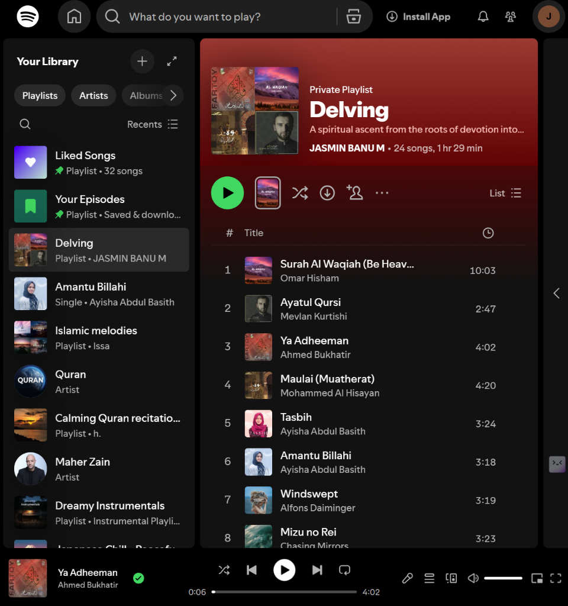

# ☁️ Delver: The Antigravity Playlist Engine


> *"A spiritual ascent from the roots of devotion into clearer skies."*



## 📖 About The Project

**Delver** is an emotionally intelligent curation engine designed to ground you, lift you, and then let you float. It doesn't just shuffle songs; it builds a bridge between emotional states.

The generated playlist, **"Antigravity – Sakeena"**, is not random. It is engineered with a mandatory "Antigravity Curve" that transitions the listener through four distinct phases of regulations.

## 🌊 The Antigravity Curve

| Phase | Zone | Emotional Intent |
| :--- | :--- | :--- |
| **I** | **Grounding** 🧱 | Deep safety, spiritual roots, and heavy grounding.<br>*(e.g., Quranic recitations, Nasheeds)* |
| **II** | **Gentle Lift** 💧 | Water textures, piano, and clarity.<br>*(e.g., Joe Hisaishi, Yiruma)* |
| **III** | **Float State** ☁️ | Weightless lofi, "antigravity", and airy dreams.<br>*(e.g., Jinsang, Nujabes)* |
| **IV** | **Soft Landing** 🕊️ | Gratitude, silence, and peace.<br>*(e.g., Arvo Pärt, Maher Zain)* |

## 🚀 Quick Start

### 1. Clone & Install
```bash
git clone https://github.com/TechJas/Delving-.git
pip install -r requirements.txt
```

### 2. Configure Credentials
Set your Spotify Developer keys in your terminal:
```bash
# Windows (CMD)
set SPOTIPY_CLIENT_ID=your_id_here
set SPOTIPY_CLIENT_SECRET=your_secret_here
set SPOTIPY_REDIRECT_URI=http://localhost:8888/callback
```

### 3. Run
```bash
python create_playlist.py
```
*Your playlist will appear instantly in your Spotify Library.*

## 🛠️ Tech Stack
- **Languages:** Python
- **Libraries:** Spotipy (Spotify Web API)
- **Authentication:** OAuth 2.0

---
*Created with ❤️ by Jasmin (TechJas)*
